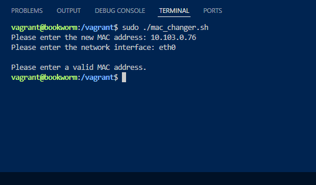
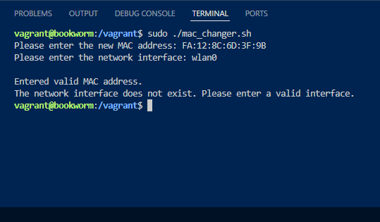
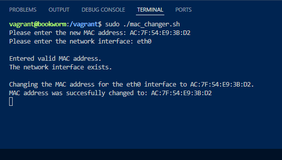
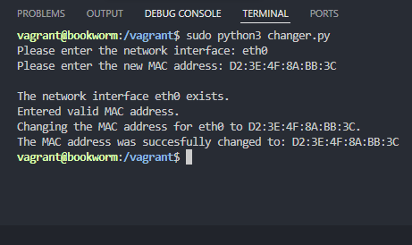

# Shell/Python MAC Address Changer

This script allows you to change the MAC address of a specified network on a Linux system with either Python or Shell.

### How to use it (Shell)
- To run the script you must use the `chmod +x` command on the file to give yourself execution privileges.
- Once you give yourself execution privileges to actually run the script you have to enter the path to the file in this case it would be `./mac_changer.sh`, the period at the beginning representing the current directory 
- You also need to run the script at the root level using the `sudo` command before the path to the file.

### How to use it (Python)

The Python MAC address changer has virtually all the same functions and works in the same way with the same dependencies as the shell implementation. However to run the Python MAC address changer you must have Python installed, and input the path to the script into the terminal with `python` or `python3` infront of the path (e.g. `python3 changer.py`). Afterward you'll be prompted to enter the network interface and the MAC address you want to change.

### Dependencies
- Bash and/or Python
- Linux operating system 

### Error handling
*This script has three functions to handle errors, `check_root`, `check_mac`, and `check_interface`.*
- `check_mac` : Makes sure that the input for the MAC address is in the right format, if not it will return an error.
- `check_root` : Checks if you are running the script at the root level with the sudo command and will prompt you to if you aren't.
- `check_interface` : Checks if the interface the MAC address will be assigned to actually exists on the system.

### Example usage (Shell)
**Errors:**

  

Example of something other than a MAC address being input into the script.

  

Example of a network interface the MAC address doesn't belong to being input.

**Changing the actual MAC address:**

Process of changing the MAC address on its actual network interface.

### Example Usage (Python)

  